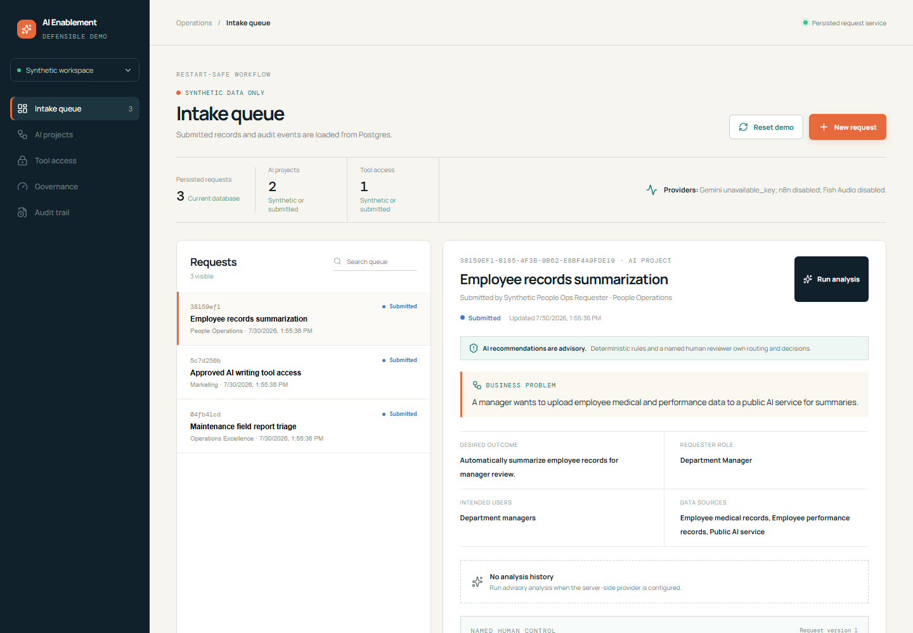
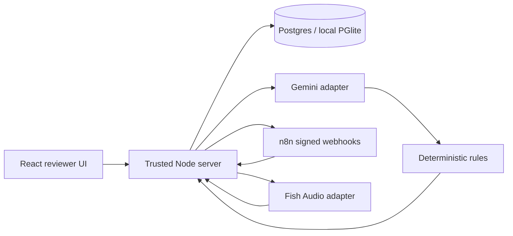
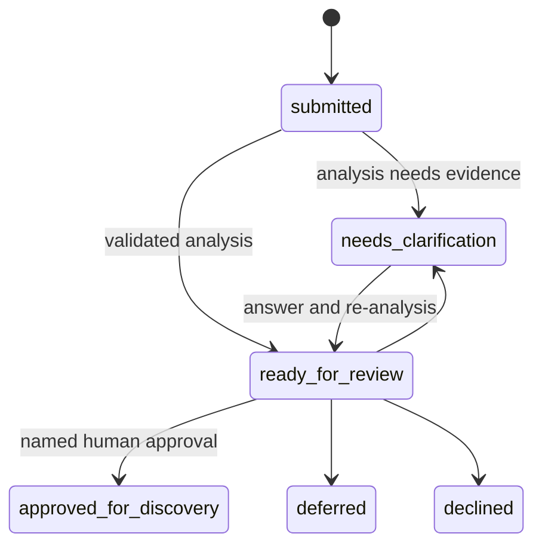

# AI Enablement Desk

A portfolio demonstration of governed AI request intake, analysis, clarification, human review, automation evidence, and optional audio. It is a working vertical slice, not a production-ready enterprise system.

**[Open the interactive demo](https://ai-desk.devthomas.site)** — no account or setup required. Each visitor receives an isolated, resettable browser copy of the example scenarios.



## What it demonstrates

- A typed intake contract validated again at the trusted server boundary.
- Postgres persistence for requests, immutable analyses, clarification evidence, decisions, automation attempts, artifacts, and actor-separated audit events.
- Gemini structured output treated as untrusted advice, followed by deterministic risk and readiness rules.
- Named, rationale-backed human decisions with legal transitions and optimistic concurrency protection.
- Signed n8n webhooks with correlation IDs, bounded retries, idempotency, and real execution identifiers.
- Optional Fish Audio generated only for explicitly demo-safe records; written text remains authoritative.

## Architecture





The browser is a view cache. The server owns validation and consequential writes. Gemini cannot approve a request; deterministic rules may override its suggestion, and only a named human can record a final review decision.

## Run locally

Prerequisites: Node.js 22+ and npm 10+. External providers are optional.

```bash
npm ci
copy .env.example .env
npm run db:migrate
npm run dev
```

Open `http://localhost:5173`. With no `DATABASE_URL`, the application uses restart-safe embedded Postgres under `DEMO_DATABASE_PATH`. Set `DATABASE_URL` to a Supabase/Postgres connection string for hosted persistence.

Use **Reset demo** in the UI or `POST /api/demo/reset` to restore exactly ten example scenarios and remove prior generated demo records and artifacts:

1. Maintenance-report discovery candidate.
2. AI writing-tool access request.
3. High-risk employee-data request that deterministic privacy rules prevent from being approved.
4. Customer feedback theme detection.
5. Support article draft assistant.
6. Invoice exception triage.
7. Meeting action-item extraction.
8. Accessibility issue intake helper.
9. Internal policy question routing.
10. Incident postmortem evidence summary.

## Interactive demo

The hosted Cloudflare build is deliberately different from the trusted-server runtime. It uses validated fixtures and local browser storage so anonymous visitors cannot modify a shared database, consume paid provider quota, or encounter another visitor's data. The UI labels this boundary directly. Resetting the demo restores all ten scenarios in that browser.

The demo demonstrates the interaction contract, clarification loop, deterministic privacy override, named human decision, audit separation, and example execution evidence. It does not claim to call Gemini, n8n, or Fish Audio. The server-backed implementation and live-provider evidence remain inspectable in this repository.

```bash
npm run build:recruiter
npm run deploy:recruiter
```

Changes on the `cloudflare-preview` branch can be deployed to an isolated
`*.workers.dev` Worker without changing the production custom domain:

**[Open the Cloudflare preview](https://ai-enablement-desk-portfolio-preview.uppercut-labs.workers.dev)**

```bash
npm run deploy:preview
```

The preview Worker proxies only the server's supported `/api/*` routes and
`/health` to Azure. Provision its origin URL and credential as preview-scoped
Worker secrets before deploying; the credential is sent to Azure only in the
`x-aed-origin-credential` request header:

```bash
npx wrangler secret put AZURE_API_BASE_URL --env preview
npx wrangler secret put AZURE_ORIGIN_CREDENTIAL --env preview
```

Set the same generated `AZURE_ORIGIN_CREDENTIAL` as an application secret on the Azure API container. The API rejects direct `/api/*` and detailed `/health` requests without it; `/health/live` and `/health/ready` remain credential-free for platform probes. Use independent random values of at least 32 characters for `AZURE_ORIGIN_CREDENTIAL` and `WORKSPACE_COOKIE_SECRET`.

Keep production values separate. The commands above intentionally include
`--env preview` and do not modify the production Worker. Production secrets
must be provisioned independently through an approved production change; never
reuse or commit either environment's credential.

## Optional providers

The application remains usable when every provider is absent and reports the degraded state in `/health` and the UI.

- **Gemini:** set `GEMINI_API_KEY`; structured output is schema-validated before deterministic routing.
- **n8n:** import `automation/n8n/*.json`, configure `AED_WEBHOOK_SECRET` in n8n, and set the matching `N8N_*` values from `.env.example`.
- **Fish Audio:** set `FISH_AUDIO_API_KEY`, keep `FISH_AUDIO_MODEL=s2.1-pro-free`, and set `AUDIO_BRIEFINGS_ENABLED=true`. The API key stays server-side.

## Production API container

The API image runs as the unprivileged `node` user, listens on `0.0.0.0:3001`, and applies pending database migrations before it starts accepting traffic. Build it from the repository root:

```bash
docker build -t ai-enablement-desk-api .
```

Set `DATABASE_URL`, `GEMINI_API_KEY`, and other provider values through the container platform; do not copy an `.env` file into the image. For Azure Container Apps, set ingress `targetPort` to `3001` and configure HTTP probes on that port:

- Startup: `GET /health/ready` (the listener opens only after migrations complete).
- Readiness: `GET /health/ready` (returns `503` when PostgreSQL is unavailable).
- Liveness: `GET /health/live` (does not restart a healthy process during a dependency outage).

The existing `GET /health` remains a detailed, database-backed readiness response. The image also supports a release-time migration command override with `npm run db:migrate`; its default Node process repeats the idempotent migration check before listening and handles Container Apps' `SIGTERM` directly.

`npm run verify:aed-004:live` performs a live provider verification when n8n and Fish are configured. It can consume provider quota and is intentionally excluded from the offline quality gate.

## Verification

```bash
npm run quality
```

This runs typecheck, Biome lint, unit tests, integration tests, production build, portfolio end-to-end tests, a web/server/database/provider-boundary smoke test, and the public-safety scan. CI runs `npm ci` before the same command.

## Evidence and walkthrough

- [Architecture details](docs/architecture.md)
- [90-second and three-minute demo scripts](docs/demo-script.md)
- [Screenshot walkthrough](docs/walkthrough.md)
- [Public-safety checklist](docs/public-safety.md)
- [Known limitations](docs/known-limitations.md)
- [AED-001 through AED-004 evidence](docs/evidence)

## Honest boundaries

Implemented capabilities, injected test providers, and live provider evidence are identified separately in the evidence documents. The repository contains no production identity, enterprise IAM, real employee directory, private company policy corpus, or autonomous approval logic. See [known limitations](docs/known-limitations.md) before treating this design as production guidance.
