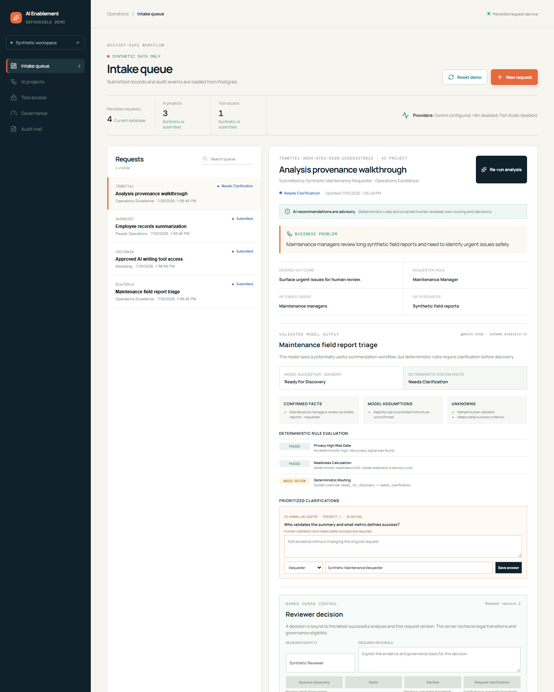
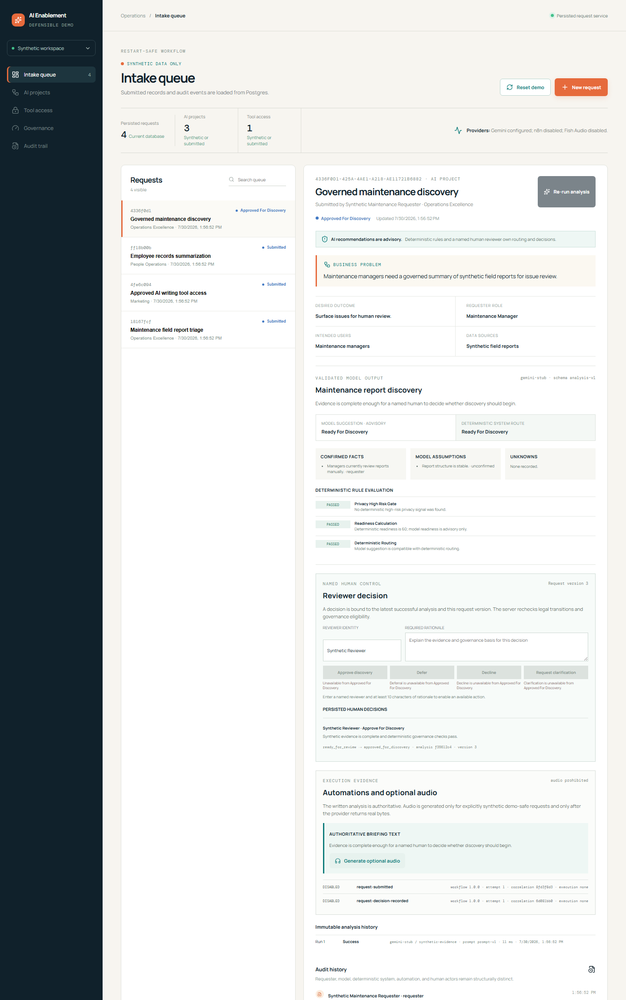

# Screenshot walkthrough

## 1. Persisted intake and queue

The queue is loaded from the request API. Reset restores the three committed synthetic scenarios; refresh does not erase submitted records.

## 2. Analysis provenance and deterministic override

The reviewer sees model provenance, confirmed facts, unconfirmed assumptions, unknowns, clarification questions, and the deterministic route separately.

## 3. Named human decision and audit history

The final decision records reviewer identity, rationale, analysis binding, version transition, and actor-separated history. Live n8n and Fish evidence is recorded in [AED-004](evidence/AED-004.md).
